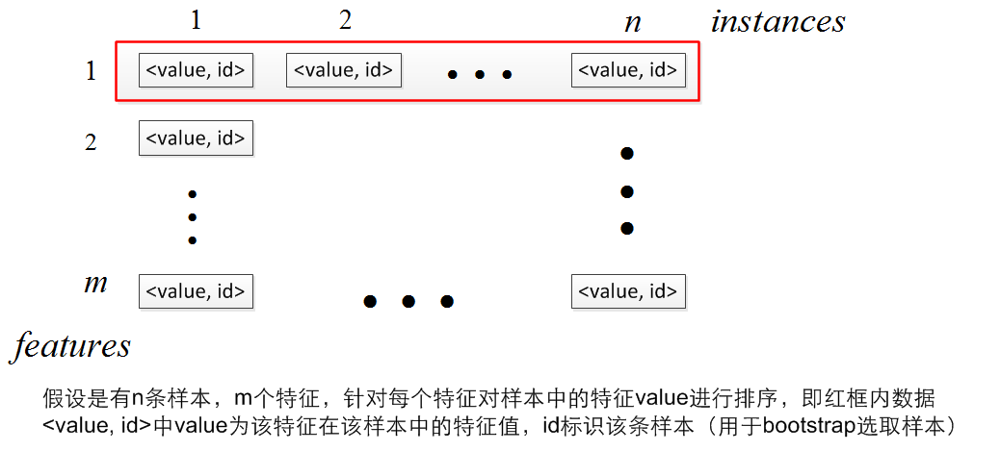
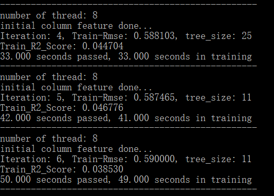
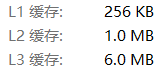

# 数据挖掘课程  --  Project 2 of Regression Task


### 姓名：陈明亮

### 学号：16340023


## 一、`Parallel-GBDT`模型算法总述
#### 1. `GBDT`模型原理
   * `Gradient Boosting Decision Tree`，梯度提升决策树，是通过生成多个连续的，有相关性的决策树，训练过程通过残差进行串行化的弱分类器生成，最终通过`Boosting`集成，也就是结合多个弱分类器的结果进行回归结果的预测。

     ​

   * `Gradient Boosting`是一种`Boosting`的方法，它主要的思想是：每一次建立模型是在之前建立模型损失函数的梯度下降方向。损失函数是评价模型性能（一般为拟合程度+正则项），认为损失函数越小，性能越好。而让损失函数持续下降，就能使得模型不断改性提升性能，其最好的方法就是使损失函数沿着梯度方向下降（讲道理梯度方向上下降最快）
     ​

   * 以决策树为基函数的提升方法称为提升树，其决策树可以是分类树或者回归树。提升树模型可以表示为决策树的加法模型，此处用于我们的`Project 2`，那么所用到的梯度提升树必然是回归树模型。通过训练完成的各个回归树模型，我们需要通过计算求和的方法，即通过累加求取最终的回归预测值，具体算法为：
     $$
     f_M(x) = \sum\limits_{m=1}^M T(x;\Theta_m)
     $$
     其中，$T(x;\Theta_m)$表示每棵不同的回归树，其中的$\Theta_m$为每个树的训练参数，$M$为全部回归树的个数。

     ​

* 介绍完`GBDT`的主要概念与集成方法之后，下面介绍在实现该算法时，另一个核心部分：如何构建回归树，即回归问题提升树的构造和训练算法：

  输入：训练数据集$T=\{(x_1,y_1),(x_2,y_2),···,(x_N,y_N)\}, x_i \in \chi = R^n, y_i \in  \gamma, \  i=1,2,···,N$

  输出：提升回归树$f_M(x)$

  1. 初始化$f_0(x)=0$

     ​

  2. 对于$m=1,2,.....,M$，逐棵构造提升树

     * 计算残差（后一棵树拟合前一颗树残差）：
       $$
       r_{mi} = y_i - f_{m-1}(x_i)
       $$

     * 拟合残差学习一个回归树，得到$T(x;\Theta_m)$

     * 更新：$f_m(x) = f_{m-1}(x) + T(x;\Theta_m)$

       ​

  3. M次迭代之后得到提升树：
     $$
     f_M(x) = \sum\limits_{m=1}^M T(x;\Theta_m)
     $$
     ​

* 上述算法针对于提升树之间的构建，在实际实现底层算法时，我们仍需要考虑的是：如何合理构造用于回归问题的决策树，即单棵回归树的构造算法：

  输入：训练数据集

  输出：单个回归树$f(x)$

  在训练数据集所在输入空间中，递归地将每个区域划分为两个子区域并决定每个子区域上的输出值，构建二叉决策树，回归树的构建往往通过最小二乘法为依据，即用于分割树节点的特征选取和特征上的某一值选取之后，必须使得分裂之后两边子集中回归值与其平均值之间的差方和最小。

  1. 选择最优切分变量j与切分点s，求解
     $$
     \min\limits_{j,s} [ \min\limits_{c_1} \sum\limits_{x_i \in R_1(j,s)} (y_i-c_1)^2 + \min\limits_{c_2} \sum\limits_{x_i \in R_2(j,s)} (y_i - c_2)^2]
     $$
     其中，$R_1(j,s) = \{x|x^{(j)} \le s\},\ \ R_2(j,s) = \{x|x^{(j)} \ge s\}$，遍历变量`j`，对固定切分变量j扫描切分点`s`，选择是上式达到最小值的对`(j,s)`

     ​

  2. 用选定的对`(j,s)`划分区域并决定相应的输出值
     $$
     R_1(j,s) = \{x|x^{(j)} \le s\},\ \ R_2(j,s) = \{x|x^{(j)} \ge s\}
     $$

     $$
     \hat{c} = \frac{1}{N_m} \sum\limits_{x_i  \in R_m(j,s)} y_i,x \in R_m, m =1,2
     $$

     ​

  3. 继续对两个子区域调用步骤1,2，直到满足停止条件

  4. 将输入空间划分为`M`个区域，$R_1,R_2,···R_m$，生成决策树：
     $$
     f(x) = \sum\limits_{m=1}^{M} \hat{c} I(x \in R_m)
     $$
     ​

* 综上，对串行化`GBDT`的算法步骤已经完成解析，主要分为：单个回归树的训练生成算法，多个提升回归树的串行化生成法，基于提升树的集成预测回归结果算法，下面结合各方面步骤，对`GBDT`模型进行整体描述：

  输入：训练数据集$T=\{(x_1,y_1),(x_2,y_2),···,(x_N,y_N)\}, x_i \in \chi = R^n, y_i \in  \gamma, \  i=1,2,···,N$

  输出：训练完成的梯度提升回归树集合${f_I(X)}$

  1. 初始化
     $$
     f_0(x) = arg \min\limits_c \sum\limits_{i=1}^N L(y_i,c)
     $$
     ​

  2. 对于$m=1,2,3,....M$

     * 对于$n=1,2,3,....,N$，计算当前残差
       $$
       r_{mi}= -[\frac{\partial L(y,f(x_i))}{\partial f(x_i)}]_{f(x)=f_{m-1}(x)}
       $$

     * 对$r_{mi}$拟合一颗回归树，得到第m棵树的叶结点区域$R_{mj}, j=1,2,...J$，即一棵由`J`个叶子节点组成的树，通过回归树生成算法，合理地选择每个`Iteration`的分裂特征与分裂特征值，完成单棵回归树的训练

     * 更新$f_m(x)=f_{m-1}(x) + \sum\limits_{j=1}^J c_{mj} I(x \in R_{mj})$

       ​

       ​

  3. 得到回归树
     $$
     \hat{f}(x) = f_M(x) = \sum\limits_{m=1}^M f_m(x) = \sum\limits_{m=1}^M \sum\limits_{j=1}^J c_{mj}I(x \in R_{mj})
     $$
     ​


#### 2. 模型并行化方法

* 在介绍完`GBDT`的基本原理之后，我们可以清晰地看到：`Boosting`为核心的模型算法，往往是不能通过并行化建立回归树，来达到训练过程的并行化的，因为回归树之间有联系，残差的计算往往需要依赖于前一棵训练完成的回归树。

  所以，我们将并行化的过程，放在建立单棵回归树上，即在进行回归树节点分裂时，并行化选择其最佳分裂点，利用多线程完成单棵回归树的整体构建、训练步骤。

  ​

* 此处我们将并行化操作放在选取特征点，特征值分裂过程进行。在每个层次上，决策树的顺序构建过程都有两个循环，第一个循环是用于枚举叶节点的外部循环，第二个循环是用于枚举特征的内部循环。这种方法的思想是交换这两个循环的顺序，这样我们就可以在同一个级别上对不同的特性并行进行分割查找。我们可以看到，通过改变循环的顺序，我们还可以避免对每个节点中的实例进行排序。我们可以在整个构建过程的开始对实例进行排序，然后在每个级别使用相同的排序结果。另一方面，需要注意的是，为了保证算法的正确性，在线性扫描过程中，每个线程都需要小心地保持每个叶节点的扫描状态，这大大增加了算法的编码复杂度

  用颠倒两个`for`循环的策略，并行地去找同一层的特征分割点，只在建树开始的时候对所有特征的所有`value`进行排序，在遍历过程中记录对于某一特征fid其各个样本所对应的`node`

  

  


## 二、采用`C++`实现并行化的梯度提升回归树模型

此次实验本人采用`C++`编程语言，从最底层的回归树构造开始编写程序，下面分别基于模型的各个步骤，通过代码解析模型在此步骤的核心部分。

0. 数据的读取、程序初始化

   ```c++
   while(true){
       // Check end of file
       if (feof(feature_fp) || feof(label_fp)) {
           break;
       }

       vector<double> feats(13, 0);
       double label = 0.0;
       // First Read features csv
       fscanf_s(feature_fp, "%lf,%lf,%lf,%lf,%lf,%lf,%lf,%lf,%lf,%lf,%lf,%lf,%lf",&feats[0],
                &feats[1],&feats[2],&feats[3],&feats[4],&feats[5],&feats[6],
                &feats[7],&feats[8],&feats[9],&feats[10],&feats[11],&feats[12]);
       // Then Read labels csv
       fscanf_s(label_fp, "%lf", &label);
       vals_features.push_back(DFeature(feats, label));
       // Push into final train datas
       train_labels.push_back(label);
       train_feats.push_back(feats);
   }
   ```

   分别对单个`train_i.csv`文件执行上述操作，读取`csv`文件内部的训练数据，以及相应的训练集`label`，存入`vector`中便于之后的参数传递。

   ​

   ```c++
   for (int i = 0; i < 5; i++) {
       BoostedForest temp =  BoostedForest();
       forests.push_back(temp);
   }
   ```

   针对于五部分的训练集，分别构造五个`parallel_gbdt`，之后再根据集成操作，获取模型针对于某个测试数据的预测值

   ​


1. 并行化构造单棵回归树

   * 使用`OpenMP`调用多个线程执行并行工作

     ```c++
     #pragma omp parallel for schedule(static)
     ```

     ​

   * 线程信息记录结构体

     ```c++
     struct ThreadInfo {
     	int cnt0; // Right num of instances for split
     	double sum0, ss0;
     	double last_val;
     	SplitInfo spinfo;
     };
     ```

     用于记录某一线程中，获取到的最佳分裂点的信息，以便于最后决出全局最佳分裂点对应的特征属性和该属性上的特征值

     ```c++
     struct SplitInfo {
     	int bind; // Feature ID
     	double bsplit; // Split Threshold
     	int cnt[2]; // Num of instances for right and left
     	double sum_y[2], sum_sqr_y[2];
     	double err;
     };
     ```

     分裂点信息，其中记录的当前分裂点左右子集的信息，如分裂点好坏的判定标准：左右子集与其平均值的差方和

     ​

   * 并行化对多个特征属性进行最佳分裂点的选取

     ```c++
     #pragma omp parallel for schedule(dynamic,1)
     for (int fid = 0; fid < m; fid++) {         
         const int tid = omp_get_thread_num();
         find_split(fid, col_fea_list[fid], tinfos[tid]);
     }
     ```

     `find_split()`函数即为并行选取最佳分裂点的关键函数

     ```c++
     // each instances
     for (int i = 0; i < fea_list.size(); i++) {
         int iid = fea_list[i].second; // instance id
         int pos = positions[iid]; // which node of q belong to
         if (pos < 0) 
             continue;

         fea_list[top++] = fea_list[i];
         int nid = q[pos].nid; // node id of whole tree
         ThreadInfo &tinfo = tinfo_list[pos];
     	// Multi-Thread Checking
         if (tinfo.cnt0 >= min_children && q[pos].cnt - tinfo.cnt0 >= min_children 
             && sign(fea_list[i].first - tinfo.last_val) != 0) {
             double &sum0 = tinfo.sum0;
             double &ss0 = tinfo.ss0;
             sum1 = tree[nid].sum_y - sum0;
             ss1 = tree[nid].sum_sqr_y - ss0;
     	   // Calculate the square loss
             err = ss0 + ss1 - sum0 * sum0 / tinfo.cnt0 - sum1 * sum1 / (q[pos].cnt-tinfo.cnt0);
             // save new split info for this node
             if (sign(err - tinfo.spinfo.err) < 0) {
                 SplitInfo &tbest = tinfo.spinfo;
                 tbest.err = err;
                 tbest.bind = fid;
                 tbest.bsplit = (fea_list[i].first + tinfo.last_val) / 2; // split threshold
                 tbest.sum_y[0] = sum0; tbest.sum_y[1] = sum1;
                 tbest.sum_sqr_y[0] = ss0; tbest.sum_sqr_y[1] = ss1;
                 tbest.cnt[0] = tinfo.cnt0; tbest.cnt[1] = q[pos].cnt - tinfo.cnt0;
             }
         }
         tinfo.cnt0 += 1;
         tinfo.sum0 += y_list[iid];
         tinfo.ss0 += sqr_y_list[iid];                                               
         tinfo.last_val = fea_list[i].first;            
     }
     ```

     上述代码段为`find_split()`函数的核心代码，可以看到不同线程执行了一种特征属性的最佳分裂值的计算，查询过程是通过之前排好序的结果，进行线性搜索，最终通过一轮一轮的比较，找到最小平均差方的分裂点特征属性值，存储为当前线程的最优分裂点，以及对应的各项信息。最终综合多个线程的最优值，找出全局的最佳分裂点，成功实现并行化。

     ​

   * 程序并行建树的中间结果截图

     

     可以看到，面对已有的训练数据量，我们开启8个线程并行构建回归树，一颗回归树的构建时间大约为：7~8秒，实际上训练速度得到的很大的提升，并行化效果显著。

   ​

2. 梯度提升回归树的构建

   此处的梯度提升回归树构建，首先需要计算当前的残差，然后再根据残差所得，输入到一般的回归树构建过程(即上一步骤中)，即可完成：

   ```c++
   // update residual for each instance
   for (int j = 0; j < features.size(); j++)
       features[j].y = ori_vals[j] - cur_vals[j];
   // create a decision tree, the only different is features.y(residual)
   DecisionTree *dt = new DecisionTree(features, depth, max_feature, max_pos, min_children, bootstrap, nthread);
   trees.push_back(dt);
   ```

   ​

3. 模型集成

   结合最终训练所得的各项回归树，采用求取平均值的方法进行回归器集成：

   单个`gbdt`的预测函数：

   ```c++
   double predictForest(vector<double> &f) {
       double ret = 0; 
       for (int j = 0; j < trees.size(); j++) {
           ret += trees[j]->predictTree(f) * steps[j];

       }        
       return ret;
   }
   ```

   多个`gdbt`的平均集成：

   ```c++
   double predictResult(vector<double>& feats, int size) {
   	double pred = 0.0f;
   	for (int i = 0; i < size; i++) {
   		pred += forests[i].predictForest(feats);
   	}
   	pred /= size;
   	return pred;
   }
   ```

   ​

4. 模型所得成绩：

   


## 三、并行化方法的Cache优化

1. 首先查看本地PC机的CPU Cache信息，主要将重点放在L1和L2，L3缓存容量上，再根据三者的容量进行并行化程序的加速：

   

   ​

2. 结合并行化设计中的Cache问题一文，得知解决并行化程序中的Cache问题，应该考虑的是如何设计每一轮迭代中，让缓存数据不填满本地PC机上的缓存设备，而是留出一些空间给附加数据，防止读取数据时Cache产生的大规模数据丢弃情况。所以此处的Cache优化方法围绕着每一轮对训练分配数据的规模限制开始。


3. 方法一：适当地减小数组元素个数，使其不至于一次性填满L1，L2缓存的所有空间。

   方法二：对于多位数组，尽可能地将每一维都设置成2的n次幂，加快访问速度。

   ​

4. 不仅如此，为了加快Cache的访问速度，必须遵循下面两条规则 : 

   * 根据多重嵌套循环并行化原则 : 尽量并行化最外层循环 , 使得在并行区域内获得最大工作量 ;
   * 多重嵌套循环最内层循环变量应为变化最快的可变下标变量 , 且在最内层内按顺序访问数组元素(即是按数组列访 问) 


## 四、工程目录简述

* `src`路径放置该项目的`VS`工程，在`windows-VS2017`环境下打开`.sln`文件即可运行

* `report`路径放置项目报告

* `result`路径放置预测结果`csv`文件

  ​


## 五、实验感想

1. 本次作业难度较大，刚开始在实现非并行化`gbdt`的时候也花费了很多的时间和精力，发现不实现并行化时程序的运行速度很慢，所以只能查找很多资料，钻研各种可以实现并行化的点，最后也算是完成了本次作业，成功实现了并行化构造回归模型。

   ​

2. 最终的分数并没有想象中的多，可能模型方面仍需要改进，考虑的点不充足，希望在之后的课程中能够学习更多关于数据挖掘效果提升的方法吧。